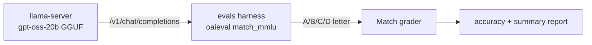

# Running gpt-oss-20b on llama.cpp and evaluating MMLU

This guide shows how to serve **gpt-oss-20b** with [llama.cpp](https://github.com/ggml-org/llama.cpp)
and run the `evals` MMLU benchmark against it. llama.cpp's `llama-server` exposes an
OpenAI-compatible `/v1/chat/completions` endpoint, so the existing `evals` harness can
talk to it with no model-specific code.

The whole flow is automated by
[`evals_llama_cpp.sh`](../scripts/evals_llama_cpp.sh); this document
explains what each step does so you can reproduce or adapt it.

## Overview



## Prerequisites

| Component | Path used here | Notes |
|-----------|----------------|-------|
| llama.cpp (CUDA build) | `~/llama.cpp/build/bin/llama-server` | Build with `-DGGML_CUDA=ON` |
| gpt-oss-20b GGUF | `~/gguf/gpt-oss-20b/gpt-oss-20b-mxfp4.gguf` | MXFP4 MoE, ~11.27 GiB |
| `evals` venv | `~/venv` | needs `evals` + `openai` installed |
| GPU | 1× H200 (≈141 GiB) | model + KV cache fit easily; pin a free GPU |

Confirm the venv can import what we need:

```sh
OPENAI_API_KEY=dummy ~/venv/bin/python -c "import evals, openai; print('ok')"
```

## Step 1 — Build llama.cpp with CUDA (one-time)

```sh
cd ~/llama.cpp
cmake -B build -DGGML_CUDA=ON -DCMAKE_BUILD_TYPE=Release
cmake --build build --config Release -j --target llama-server llama-cli
```

This produces `build/bin/llama-server`.

## Step 2 — Get the gpt-oss-20b GGUF

Use a prebuilt MXFP4 GGUF (e.g. from the `ggml-org`/`unsloth` gpt-oss releases) or
convert the HF checkpoint with `convert_hf_to_gguf.py`. Place it at a known path, e.g.
`~/gguf/gpt-oss-20b/gpt-oss-20b-mxfp4.gguf`.

## Step 3 — Launch `llama-server`

gpt-oss is a reasoning model with a Harmony chat template, so enable the jinja
template engine (`--jinja`). Pin to an idle GPU with `CUDA_VISIBLE_DEVICES` so you
don't disturb other workloads.

```sh
CUDA_VISIBLE_DEVICES=7 \
~/llama.cpp/build/bin/llama-server \
  -m ~/gguf/gpt-oss-20b/gpt-oss-20b-mxfp4.gguf \
  --alias gpt-oss-20b \
  --host 127.0.0.1 --port 8099 \
  -ngl 99 \          # offload all layers to GPU
  -c 32768 \         # total context, split across slots
  -np 8 \            # 8 parallel server slots (concurrent requests)
  -fa auto \         # flash attention
  --jinja
```

Optional: cap reasoning length to speed up the run with
`--chat-template-kwargs '{"reasoning_effort":"low"}'` (`low|medium|high`).

Wait until the health endpoint reports ready (model load takes a few minutes):

```sh
curl -fsS http://127.0.0.1:8099/health   # -> {"status":"ok"}
```

## Step 4 — Point `evals` at the server

`evals` needs a completion function that targets the local server and returns a clean
`A`/`B`/`C`/`D` letter (gpt-oss emits reasoning content, so we extract the final
choice). The repo already ships
[`OpenAIChatChoiceLetterFn`](../evals/completion_fns/openai_chat_choice_letter.py) for
exactly this. Register it via a small YAML (put it under any directory you pass with
`--registry_path`, e.g. `my_registry/completion_fns/llama_cpp.yaml`):

```yaml
llamacpp/gpt-oss-20b:
  class: evals.completion_fns.openai_chat_choice_letter:OpenAIChatChoiceLetterFn
  args:
    model: gpt-oss-20b
    api_base: http://127.0.0.1:8099/v1
    api_key: dummy
    extra_options:
      temperature: 0
      max_tokens: 3072
```

## Step 5 — Run the MMLU eval

`match_mmlu` is the full 14,042-sample MMLU set (defined in
[`evals/registry/evals/mmlu_local.yaml`](../evals/registry/evals/mmlu_local.yaml)),
graded by the deterministic `Match` grader.

```sh
cd ~/evals
OPENAI_API_KEY=dummy EVALS_THREADS=8 \
~/venv/bin/oaieval llamacpp/gpt-oss-20b match_mmlu \
  --registry_path my_registry \
  --record_path ~/eval_runs/mmlu.jsonl
```

- `EVALS_THREADS` should match the server's `-np` for best throughput.
- Add `--max_samples N` for a quick smoke test, or use a single subject such as
  `match_mmlu_anatomy`.

The final accuracy is printed and also stored in the `final_report` event of the
record file:

```sh
grep '"final_report"' ~/eval_runs/mmlu.jsonl | tail -1
```

## One-command wrapper

All of the above (launch server → wait for health → generate registry → run eval →
parse accuracy → write summary → shut server down) is wrapped by
[`evals_llama_cpp.sh`](../../dev/scripts/h200_17/evals_llama_cpp.sh):

```sh
# Full MMLU on the idle GPU 7
CUDA_VISIBLE_DEVICES=7 PARALLEL=8 CTX=32768 PORT=8099 \
  ./evals_llama_cpp.sh --eval match_mmlu

# Quick smoke test
./evals_llama_cpp.sh --eval match_mmlu_anatomy --max-samples 5 --reasoning-effort low
```

Useful options: `--eval`, `--max-samples`, `--port`, `--ngl`, `--ctx`, `--parallel`,
`--reasoning-effort`, `--no-server` (reuse a running server), `--outdir`.

## Recorded results

Full MMLU run on a single H200 (GPU pinned so it did not disturb a concurrent
training job on the other GPUs):

| Setting | Value |
|---------|-------|
| Model | gpt-oss-20b, MXFP4 MoE GGUF (~11.27 GiB) |
| Runtime | llama.cpp `llama-server`, CUDA, `-ngl 99 -c 32768 -np 8 -fa auto --jinja` |
| Eval | `match_mmlu` (14,042 samples, full set) |
| Completion fn | `llamacpp/gpt-oss-20b` (choice-letter extractor), `temperature=0` |
| Threads | `EVALS_THREADS=8` |
| GPU memory | ~13 GiB used |
| Wall-clock | ~2 h 58 m |

**Result: MMLU accuracy = 0.8314 (83.14%)**, bootstrap_std = 0.0031.

```text
Final report: {'accuracy': 0.8314342686227033, 'boostrap_std': 0.003131661379829907}
```

For reference, throughput of the same GGUF on this H200 (`llama-bench`):

| test | t/s |
|------|-----|
| pp512 (prefill) | 9576.96 ± 76.44 |
| tg128 (decode)  | 297.14 ± 1.44 |

## Notes & troubleshooting

- **Letter extraction**: gpt-oss returns chain-of-thought in `reasoning_content`; the
  choice-letter completion fn looks for the final `A/B/C/D` in both the visible content
  and the reasoning, so the `Match` grader sees a clean answer.
- **`Could not fetch API model IDs from OpenAI API` (401)**: harmless. The `evals`
  registry tries to reach the real OpenAI API at import; the dummy key fails but the
  run uses the local server.
- **`Failed to add token usage to result`**: harmless logging warning from usage
  aggregation; it does not affect accuracy.
- **Context vs. slots**: each of the `-np` slots gets `ctx / np` tokens. Keep
  `ctx / np` ≥ prompt + `max_tokens` (≈ a few hundred + reasoning) to avoid truncation.
- **Reasoning effort vs. speed**: default (medium) reasoning maximizes accuracy but is
  slow over 14k samples; `--reasoning-effort low` trades some accuracy for speed.
```

